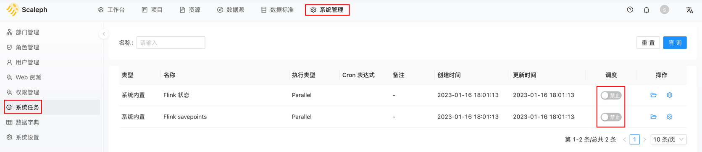

`scaleph` 部署成功后，通过 `sys_admin/123456` 登录 [http://localhost](http://localhost) 后，系统维护者或者管理员需要先行对系统进行初始化，填充用户进行数据开发的必须配置和文件。

## 资源上传

`scaleph` 镜像不在包含 Flink 和 SeaTunnel release，以减少 `scaleph-api` 镜像体积大小。

对于 Flink 和 SeaTunnel 任务提交期间需要的依赖，需管理员部署应用后自行上传。

### Flink Release

用户需自行下载 1.13.6 版本的 [Flink Release](https://archive.apache.org/dist/flink/flink-1.13.6/)，下载完成后在 `资源 -> Flink Release` 上传：

上传完成后页面如下：

### SeaTunnel Release

用户需自行下载 2.3.0 版本的 [SeaTunnel Release](https://seatunnel.apache.org/download/)，下载完成后在 `资源 -> SeaTunnel Release` 上传：

上传完成后页面如下：

因为 SeaTunnel Release 中不在包含 connector jar，需用户自行[下载](https://repo1.maven.org/maven2/org/apache/seatunnel/)并上传 v2 connector jars 至 `scaleph` 中，详情参阅 [Step 3: Install connectors plugin](https://seatunnel.apache.org/docs/2.3.0/start-v2/locally/deployment#step-3-install-connectors-plugin)。

注意：SeaTunnel v2 connectors 众多，用户可选择业务需要的 connector 下载上传即可，无需全部上传。

### Cluster Credential

`scaleph` 支持多集群部署，即用户可以将 Flink 或 SeaTunnel 任务部署至多个 YARN 或 Kubernetes 集群。

用户需上传 YARN 或 Kubernetes 集群配置文件，帮助 `scaleph` 连接对应的集群，通过相应的权限验证以提交任务到对应的集群。

`scaleph` 支持如下三种集群：

- Standalone。Flink 任务提交时需获取 JobManager 的 `jobmanager.rpc.address` 和 `jobmanager.rpc.port` 配置连接 Standalone 集群，而 Standalone 集群的 `flink-cconf.yaml` 文件中包含此配置项。
- YARN。用户上传的 Hadoop 集群配置必须包含 `core-site.xml` 和 `hdfs-site.xml` 文件，其余的 Hadoop 配置也需要一起上传，不是只上传 2 个。
- Kubernetes。上传 kubeconfig 文件，一般为 `$HOME/.kube/config`。

## 启动调度

`scaleph` 应用本身运行需要定时任务，同步提交的 Flink 任务状态和 checkpoint 数据。

应用部署好后，需启动 `scaleph` 系统调度任务：

